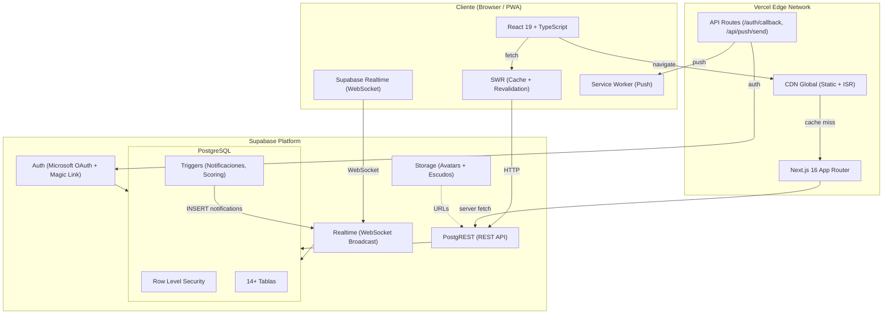
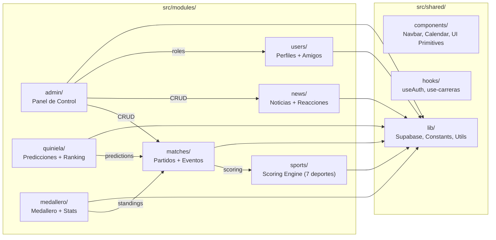
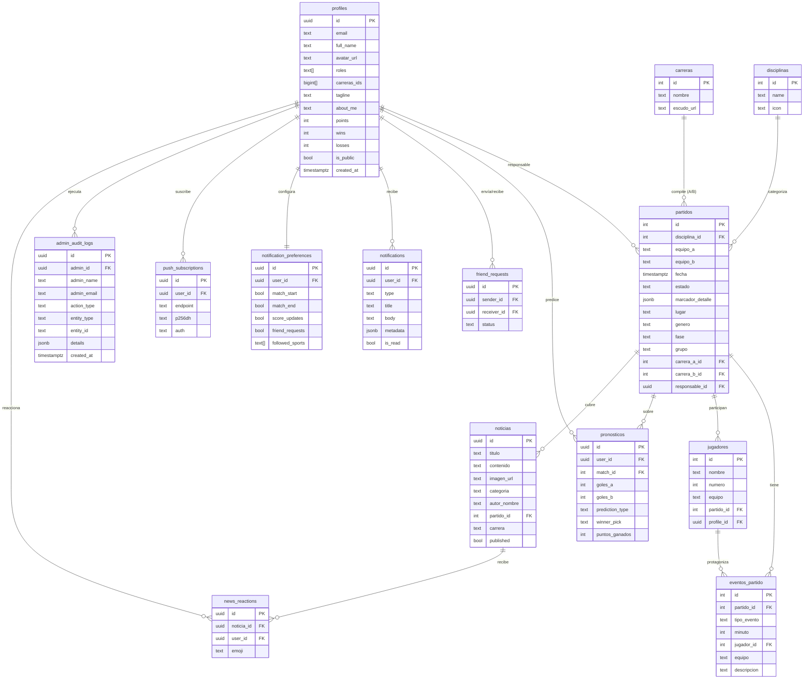
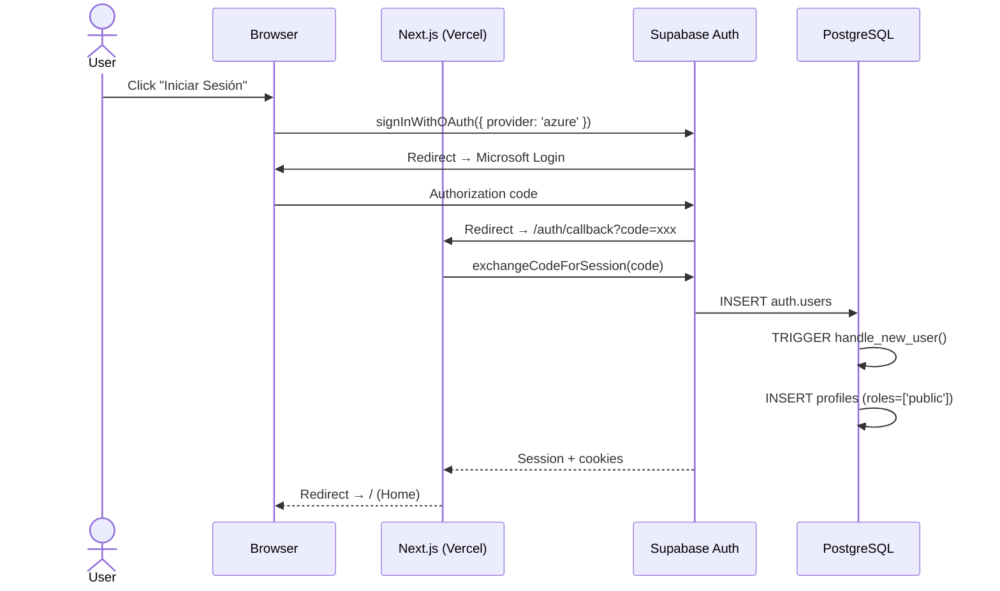
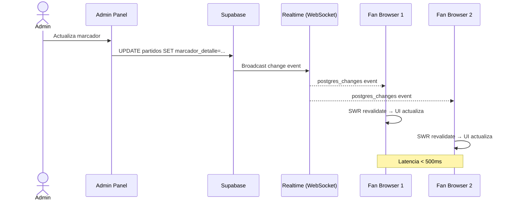
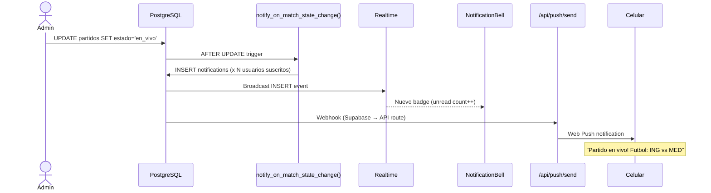
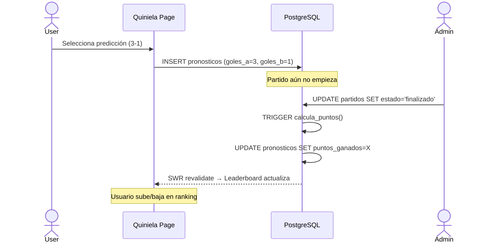
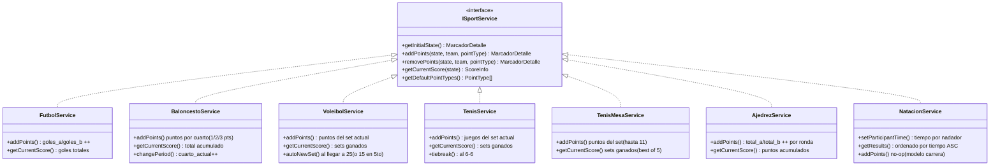

# Arquitectura del Sistema — Giga Olympics UNINORTE 2026

> Última actualización: 2026-03-18

---

## 1. Visión General del Sistema



---

## 2. Estructura de Módulos Frontend



Cada módulo sigue la estructura:
```
module/
├── types.ts          # Tipos TypeScript centralizados
├── hooks/            # SWR hooks + Realtime subscriptions
├── components/       # UI components del módulo
└── services/         # Lógica de negocio (solo sports/)
```

---

## 3. Rutas de la Aplicación

### Páginas Públicas (11)

| Ruta | Archivo | Descripción |
|------|---------|-------------|
| `/` | `app/page.tsx` | Home — Hero slider, partidos en vivo, noticias recientes |
| `/calendario` | `app/calendario/page.tsx` | Calendario mensual + partidos por día |
| `/partidos` | `app/partidos/page.tsx` | Lista completa de partidos con filtros |
| `/partido/[id]` | `app/partido/[id]/page.tsx` | Detalle del partido — marcador en vivo, eventos, timeline |
| `/noticias` | `app/noticias/page.tsx` | Feed de noticias (ISR, revalidate=60s) |
| `/noticias/[id]` | `app/noticias/[id]/page.tsx` | Artículo completo con reacciones |
| `/medallero` | `app/medallero/page.tsx` | Tabla de medallas por carrera |
| `/clasificacion` | `app/clasificacion/page.tsx` | Rankings y clasificaciones |
| `/mapa` | `app/mapa/page.tsx` | Mapa interactivo del campus |
| `/tv` | `app/tv/page.tsx` | Vista de transmisión en vivo |
| `/quiniela` | `app/quiniela/page.tsx` | Sistema de predicciones y leaderboard |

### Páginas de Usuario (5)

| Ruta | Archivo | Descripción |
|------|---------|-------------|
| `/login` | `app/login/page.tsx` | Login (Microsoft OAuth / Magic Link) |
| `/perfil` | `app/perfil/page.tsx` | Perfil propio (editable) |
| `/perfil/[id]` | `app/perfil/[id]/page.tsx` | Perfil público de otro usuario |
| `/carrera/[id]` | `app/carrera/[id]/page.tsx` | Perfil de carrera universitaria |
| `/notificaciones` | `app/notificaciones/page.tsx` | Centro de notificaciones |

### Panel de Administración (9)

| Ruta | Archivo | Descripción |
|------|---------|-------------|
| `/admin` | `app/admin/(dashboard)/page.tsx` | Dashboard — stats en vivo, actividad |
| `/admin/partidos` | `app/admin/(dashboard)/partidos/page.tsx` | CRUD de partidos |
| `/admin/partidos/[id]` | `app/admin/(dashboard)/partidos/[id]/page.tsx` | Control de partido en vivo — scoreboard, eventos |
| `/admin/noticias` | `app/admin/(dashboard)/noticias/page.tsx` | Gestión de noticias |
| `/admin/noticias/nueva` | `app/admin/(dashboard)/noticias/nueva/page.tsx` | Crear noticia |
| `/admin/noticias/[id]` | `app/admin/(dashboard)/noticias/[id]/page.tsx` | Editar noticia |
| `/admin/usuarios` | `app/admin/(dashboard)/usuarios/page.tsx` | Gestión de usuarios y roles |
| `/admin/estadisticas` | `app/admin/(dashboard)/estadisticas/page.tsx` | Analytics y gráficas |
| `/admin/bitacora` | `app/admin/(dashboard)/bitacora/page.tsx` | Audit log de acciones admin |

### API Routes (2)

| Ruta | Archivo | Descripción |
|------|---------|-------------|
| `/auth/callback` | `app/auth/callback/route.ts` | OAuth callback — intercambia código por sesión |
| `/api/push/send` | `app/api/push/send/route.ts` | Envío de push notifications via Web Push API |

---

## 4. Modelo de Base de Datos



---

## 5. Flujos de Datos

### 5a. Autenticación (Microsoft OAuth)



### 5b. Marcador en Vivo (Realtime)



### 5c. Sistema de Notificaciones



### 5d. Quiniela (Predicciones)



---

## 6. Sports Scoring Engine



**Registry:**
```typescript
// src/modules/sports/index.ts
getSportService('Fútbol')      → FutbolService
getSportService('Baloncesto')  → BaloncestoService
getSportService('Voleibol')    → VoleibolService
getSportService('Tenis')       → TenisService
getSportService('Tenis de Mesa') → TenisMesaService
getSportService('Ajedrez')     → AjedrezService
getSportService('Natación')    → NatacionService
```

---

## 7. Seguridad — Roles y Row Level Security (RLS)

### Roles del Sistema

| Rol | Descripción | Asignación |
|-----|-------------|------------|
| `public` | Usuario registrado base | Automático al registrarse |
| `deportista` | Atleta/participante | Asignado por admin |
| `periodista` | Puede publicar noticias | Asignado por admin |
| `data_entry` | Puede gestionar partidos y eventos | Asignado por admin |
| `admin` | Acceso total al sistema | Asignado manualmente |

### Matriz de Permisos (RLS)

| Tabla | `public` | `deportista` | `periodista` | `data_entry` | `admin` |
|-------|----------|-------------|-------------|-------------|---------|
| **profiles** | SELECT (public) | SELECT (public) | SELECT (public) | SELECT (public) | ALL |
| **partidos** | SELECT | SELECT | SELECT | INSERT/UPDATE/DELETE | ALL |
| **eventos_partido** | SELECT | SELECT | SELECT | INSERT/DELETE | ALL |
| **noticias** | SELECT (published) | SELECT (published) | ALL | SELECT (published) | ALL |
| **pronosticos** | Own CRUD | Own CRUD | Own CRUD | Own CRUD | ALL |
| **notifications** | Own SELECT/UPDATE/DELETE | Own SELECT/UPDATE/DELETE | Own SELECT/UPDATE/DELETE | Own SELECT/UPDATE/DELETE | ALL |
| **friend_requests** | Own CRUD | Own CRUD | Own CRUD | Own CRUD | ALL |
| **admin_audit_logs** | --- | --- | --- | --- | SELECT + INSERT |
| **push_subscriptions** | Own CRUD | Own CRUD | Own CRUD | Own CRUD | ALL |

**Función helper:** `public.has_role(auth.uid(), 'admin')` — verifica si el usuario tiene un rol específico en el array `profiles.roles`.

---

## 8. Stack Tecnológico

### Frontend
| Tecnología | Versión | Uso |
|-----------|---------|-----|
| Next.js | 16.1.6 | Framework (App Router, ISR, SSR) |
| React | 19.2.3 | UI Library |
| TypeScript | 5.x | Type Safety |
| Tailwind CSS | 4.x | Styling |
| SWR | 2.4.1 | Data Fetching + Cache |
| Framer Motion | latest | Animaciones |
| Recharts | 3.7.0 | Gráficas (Estadísticas) |
| Lucide React | latest | Iconografía |
| Sonner | latest | Toast Notifications |

### Backend (Supabase)
| Servicio | Uso |
|----------|-----|
| PostgreSQL | Base de datos relacional con RLS |
| PostgREST | REST API automática |
| Realtime | WebSocket para marcadores en vivo |
| Auth | Microsoft OAuth + Magic Link |
| Storage | Avatares y escudos de carreras |

### DevOps & Testing
| Herramienta | Uso |
|------------|-----|
| Vercel | Hosting (Edge CDN + Serverless) |
| k6 | Load Testing (hasta 150 VUs) |
| Jest | 30.2.0 | Unit Tests |
| ESLint | 9.x | Linting |
| Web Push API | Push Notifications (PWA) |

### Resultados de Load Test (150 VUs, producción)
```
p95 latencia:     14.2ms
p99 latencia:     106ms
Error rate:       0.00%
Throughput:       73.5 req/s
Data transferida: 766 MB / 5 min
Checks pasados:   100%
```

---

## Diagrama de Directorios

```
project_olympics/
├── docs/
│   └── ARCHITECTURE.md          ← Este archivo
├── public/
│   └── manifest.json            # PWA manifest
├── scripts/
│   └── load-test.js             # k6 load test script
├── src/
│   ├── app/                     # 29 páginas (Next.js App Router)
│   │   ├── admin/(dashboard)/   # 9 páginas admin
│   │   ├── api/push/send/       # Push notification endpoint
│   │   ├── auth/callback/       # OAuth callback
│   │   ├── calendario/          # Calendario de partidos
│   │   ├── carrera/[id]/        # Perfil de carrera
│   │   ├── clasificacion/       # Rankings
│   │   ├── login/               # Login page
│   │   ├── mapa/                # Mapa interactivo
│   │   ├── medallero/           # Medal board
│   │   ├── noticias/            # Noticias (ISR)
│   │   ├── notificaciones/      # Centro de notificaciones
│   │   ├── partido/[id]/        # Detalle de partido
│   │   ├── partidos/            # Lista de partidos
│   │   ├── perfil/              # Perfiles de usuario
│   │   ├── quiniela/            # Predicciones
│   │   └── tv/                  # Vista transmisión
│   ├── hooks/                   # Hooks globales (useAuth, useNotifications)
│   ├── lib/                     # Utilidades (supabase, scoring, constants)
│   ├── modules/                 # 7 módulos de dominio
│   │   ├── admin/               # matches/components, matches/hooks
│   │   ├── matches/             # types, hooks, components
│   │   ├── medallero/           # types, hooks, components
│   │   ├── news/                # types, hooks, components
│   │   ├── quiniela/            # types, hooks, helpers, components
│   │   ├── sports/              # types, services (7 deportes), index
│   │   └── users/               # types, hooks, components (friends)
│   └── shared/                  # Componentes y utilidades compartidas
│       └── components/          # Navbar, Calendar, UI Primitives, Sport Icons
├── supabase/
│   └── migrations/              # SQL migrations (schema + RLS + triggers)
└── package.json
```
